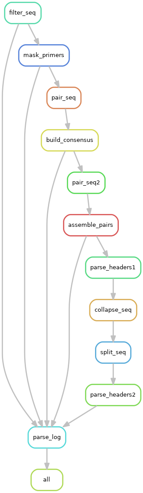

# Snakemake-presto

A Snakemake pipeline of Presto's [UMI Barcoded Illumina MiSeq 2x250 BCR mRNA preprocessing workflow.](https://presto.readthedocs.io/en/stable/workflows/Stern2014_Workflow.html)

## Dependencies
* [Conda](https://conda.io/en/latest/index.html)
* [Mamba](https://mamba.readthedocs.io/en/latest/) (optional)

Conda can be downloaded as part of the [Anaconda](https://www.anaconda.com/) or the [Miniconda](https://conda.io/en/latest/miniconda.html) plattforms (Python 3.7). We recommend to install miniconda3. 
Using Linux you can get it with:

```shell
$ wget https://repo.anaconda.com/miniconda/Miniconda3-latest-Linux-x86_64.sh
$ bash Miniconda3-latest-Linux-x86_64.sh
```

Mamba can be installed with Conda. Mamba an extremely fast and robust replacement for the Conda package manager which is highly recommended. The default conda solver is a bit slow and sometimes has issues with selecting the latest package releases. Therefore, we recommend to in any case use Mamba.

```shell
$ conda install -n base -c conda-forge mamba
```

All other dependencies will be automatically installed using conda environments with the following code.

```shell
$ mamba env create -f environment.yml
```


<p align="center"> 
    
</p>